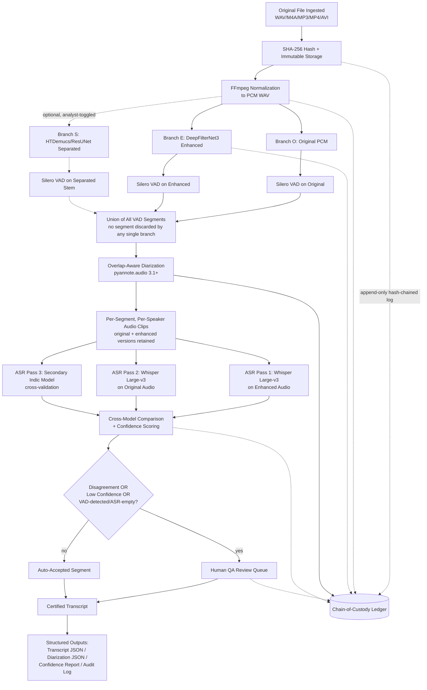

# Hybrid Forensic Audio Processing Architecture (v2)
### ACB-Style Covert Evidence — High-Recall, Court-Defensible Pipeline

**Core design principle:** *Never miss potential speech, even at the cost of retaining extra noise.*

This revision merges the original high-recall design (DeepFilterNet3 enhancement, dual-branch VAD union, Whisper Large-v3, low-confidence review queues, full audit logging) with the stronger structural ideas from the alternative proposal (modular layers, optional source separation, overlap-aware diarization, structured JSON contracts, async job orchestration). Every addition was filtered through one test: *does this risk discarding a low-amplitude speech segment?* Anything that failed that test was made optional, parallel, or advisory rather than load-bearing.

---

## 1. End-to-End Processing Flow



The shape of this graph is deliberate: every branch that could plausibly suppress a quiet voice (enhancement, separation) runs *alongside* the original rather than *replacing* it, and the two only reconverge at the VAD union step, where the rule is additive (more segments survive, never fewer).

---

## 2. Layer-by-Layer Technical Specification

### L0 — Ingestion & Hashing
**What it does:** Accepts WAV/M4A/MP3/MP4/AVI, computes SHA-256 of the byte-exact original, writes it to an immutable store, and registers a case/file ID before any decoding happens.
**Why it exists:** This is the forensic anchor. If hashing happens *after* any transcoding, the hash is meaningless for chain-of-custody — it has to be the very first operation on the very first bytes received.
**Low-amplitude safeguard:** None needed at this layer — it's a no-op on the signal. Its job is purely evidentiary.

### L1 — Format Normalization (FFmpeg → PCM WAV)
**What it does:** Transcodes the original (AAC, ADPCM, MP3, container video, etc.) to uncompressed PCM WAV. Video containers (MP4/AVI) have their audio track extracted at this stage. Two normalized outputs are produced: a high-rate copy (48kHz, matches most source hardware) for enhancement/diarization, and a 16kHz mono copy for Whisper, since Whisper resamples to 16kHz internally regardless of input — doing it explicitly and logging it avoids an undocumented implicit resample.
**Why it exists:** Lossy containers (AAC, ADPCM — note REC001.WAV-type 4-bit IMA ADPCM sources) and inconsistent sample rates/channel layouts break every downstream model's assumptions. Standardizing once, with the transformation logged, means every later stage operates on a known, declared signal.
**Low-amplitude safeguard:** This is a lossless-to-the-extent-possible transform (decoding lossy formats to PCM doesn't recover information, but it doesn't lose any more either). No gain/dynamics processing happens here — that's deliberately deferred to L2, so this layer can never be blamed for clipping a quiet passage.

### L2 — Enhancement Branch (DeepFilterNet3)
**What it does:** Runs DeepFilterNet3 (or an equivalent learned spectral-mask enhancer) on the normalized PCM to produce a denoised derivative. This branch runs **in parallel with**, not instead of, the untouched original.
**Why it exists:** For continuous-noise-floor recordings (no true silence, traffic/fan/movement bed under the whole file), enhancement is what makes a whispered or distant voice intelligible to a human reviewer and more recoverable by ASR.
**Low-amplitude safeguard:** Because the original PCM is preserved unchanged and both feed the VAD union independently (L3), an over-aggressive denoising pass can never be the *only* thing deciding whether a segment is "speech." If DeepFilterNet3 misclassifies a soft voice as noise and suppresses it, the original-branch VAD can still catch it.

### L2b — Optional Source Separation (HTDemucs / ResUNet) — analyst-controlled, off by default
**What it does:** Runs a music-source-separation-style model to isolate a vocal stem from background (traffic, fan hum, paper rustling, simultaneous TV/radio).
**Why it exists:** When two people talk over a loud fan or with a TV running, separation can recover intelligibility that no generic denoiser will. The alternative proposal's inclusion of this is genuinely useful in those specific cases.
**Why it's gated, not default:** HTDemucs/ResUNet architectures are trained for music stems (vocals vs. instruments), not for "human speech vs. arbitrary field noise." Applied blindly to a covert recording with no music, they can behave unpredictably and have a real chance of suppressing or distorting low-energy speech they weren't trained to recognize. Per the design constraint, this branch is **only invoked when an analyst explicitly flags the case** (e.g., known background music, heavy simultaneous cross-talk), and even then its output is just another parallel branch feeding the VAD union — never a replacement for the original or enhanced branches, and never load-bearing on its own.
**Low-amplitude safeguard:** Opt-in, parallel, additive-only — identical reasoning to L2.

### L3 — Voice Activity Detection, Per-Branch, Then Unioned
**What it does:** Runs Silero VAD independently on the original PCM, the DeepFilterNet3 output, and (if used) the separated stem. Operates on frame-level speech *probability*, not a binary energy threshold, with the detection threshold deliberately lowered (≈0.2–0.3 vs. the library default of 0.5) and generous pre/post padding (≈250–300ms) around each detected span. The three (or two) segment sets are then **unioned**: a timestamp is "speech" if *any* branch flagged it.
**Why it exists:** This is the layer that directly answers "no true silence regions" and "spectral gating cannot assume the existence of silent intervals." A fixed dB-threshold VAD has no way to separate a constant -25dB ambient bed from a -25dB whisper sitting inside it — they look identical to an energy detector. A neural VAD trained on spectral/temporal speech structure, run at a low threshold, catches far more borderline cases; the union across branches means a false negative in one branch (enhancer over-suppresses; original is too noisy for the model) is rescued by the other.
**Low-amplitude safeguard:** This is the central mechanism of the entire design. Lowering the threshold deliberately trades precision for recall — it will flag more non-speech noise as "maybe speech," which is the intended and accepted cost ("retain extra noise" per the design principle). Nothing is discarded here; everything flagged moves forward to diarization and ASR, where it gets a second and third chance to be correctly classified.

### L4 — Overlap-Aware Diarization (pyannote.audio 3.1+)
**What it does:** Takes the unioned speech regions and assigns speaker labels, using pyannote's joint segmentation model with overlapped-speech detection enabled, producing both discrete speaker turns and explicit overlap regions (rather than forcing overlapping speech into a single arbitrary speaker).
**Why it exists:** ACB trap evidence is evidentially worthless without speaker attribution — "who said what" is the entire legal question. Overlap-aware detection matters because trap conversations routinely have interruptions, simultaneous talking, and cross-talk that older single-speaker-per-frame diarization would mangle.
**Low-amplitude safeguard:** Diarization operates only on regions the VAD union already flagged as speech, so it cannot itself cause a low-voice segment to disappear — at worst it mislabels who said it, which is a downstream human-QA correction, not a recall loss.

### L5 — Multi-Pass ASR
**What it does:** For every diarized segment, runs three passes: Whisper Large-v3 on the enhanced audio (pass 1, generally cleanest output), Whisper Large-v3 on the original unenhanced audio for the same timestamps (pass 2, the cross-check against over-suppression artifacts), and a secondary model tuned for Telugu/Hindi/Urdu code-switching (pass 3) since a single English-centric model will systematically mis-transcribe code-switched speech. Segments are passed in as VAD-bounded clips, not fixed 30-second windows, and decoding parameters are loosened from defaults specifically to avoid silent drops (`no_speech_threshold` lowered, `logprob_threshold` loosened, `condition_on_previous_text=False` per segment to stop hallucination chains from one bad segment poisoning the next).
**Why it exists:** Whisper's own internal heuristics (its no-speech detector, its compression-ratio repetition filter) are themselves capable of silently discarding a quiet or heavily accented utterance if left at default tuning — this layer exists to override those defaults in the high-recall direction and to give every segment three independent chances to be transcribed correctly.
**Low-amplitude safeguard:** Running the original (unenhanced) audio through ASR as pass 2, in parallel with the enhanced pass 1, is the direct mitigation for "the enhancer made this segment *quieter or distorted* rather than clearer" — a known failure mode of aggressive speech enhancement on already-marginal signal.

### L6 — Cross-Model Comparison & Confidence Scoring
**What it does:** Compares pass 1/2/3 outputs per segment using a similarity metric (normalized edit distance plus a multilingual embedding similarity check, since Levenshtein alone penalizes legitimate code-switching transliteration differences too harshly), combined with each pass's own token-level confidence (average log-probability). Produces a single per-segment confidence score and a disagreement flag.
**Why it exists:** This is what turns three raw transcripts into one defensible decision per segment, and it's the mechanism that decides what needs a human.
**Low-amplitude safeguard:** Any segment where VAD flagged speech but one or more ASR passes returned an empty string is automatically treated as the *lowest* confidence category, not silently averaged away — an empty transcription on a VAD-positive segment is exactly the "missed low voice" failure this whole architecture exists to catch.

### L7 — Human QA Review Queue
**What it does:** Surfaces every flagged segment (disagreement, low confidence, or VAD-positive/ASR-empty) to a reviewer with synchronized playback of original and enhanced audio, a spectrogram view, and all candidate transcriptions side by side for accept/edit/reject.
**Why it exists:** Per the non-negotiable requirements, no machine output is the final transcript — this layer is where "machine-assisted, human-validated" actually happens, and it's also where a human ear catches anything all three models agreed on getting wrong (which does happen with heavy code-switching or extremely faint speech).
**Low-amplitude safeguard:** This is the backstop for everything upstream. Even in the worst case where enhancement, both VAD branches, and all three ASR passes underperform on a given moment, a human reviewing flagged regions with raw audio access is the last line of defense — which is why the system is built to *flag generously* rather than resolve everything automatically.

### L8 — Structured Output Generation
**What it does:** Emits the four JSON artifacts (transcript, diarization/speaker-timeline matrix, confidence report, audit log — schemas in Section 7) plus a human-readable transcript export for filing.
**Why it exists:** Structured, versioned JSON is what makes the pipeline's output usable by other tooling (DOPAMS ingestion, case management) and reviewable independently of the pipeline that produced it.
**Low-amplitude safeguard:** N/A — this is a serialization layer over already-decided content.

### L9 — Chain-of-Custody Ledger (cross-cutting)
**What it does:** Every layer above writes an entry here: input hash, output hash, model name + version + checkpoint hash, parameters used, timestamp, and operator/job ID. Entries are hash-chained (each entry includes the hash of the previous entry) so the log itself is tamper-evident.
**Why it exists:** This is what makes the pipeline "court-defensible" rather than just accurate — an opposing counsel can challenge *how* a transcript was produced, and this ledger is the answer.
**Low-amplitude safeguard:** N/A — evidentiary, not signal-processing.

---

## 3. Decision Points & Fallback Logic

| Decision point | Condition | Fallback |
|---|---|---|
| Enhancement model unavailable/crashes | DeepFilterNet3 worker exception | Pipeline continues on original-only branch, job flagged `degraded_enhancement`, never silently skipped |
| Source separation requested but reduces VAD-segment count vs. pre-separation | Post-separation VAD finds *fewer* speech regions than pre-separation union | Separated branch is logged but excluded from the union; original+enhanced branches still govern recall |
| Diarization fails on heavy overlap | pyannote confidence below threshold across a region | Region kept as single undifferentiated "multi-speaker" segment, flagged for manual speaker tagging — never dropped |
| Whisper hallucination detected | Repetition/compression-ratio anomaly on a segment | Re-run that segment alone at smaller chunk size with `temperature` fallback ladder (0 → 0.2 → 0.4 → 0.6 → 0.8 → 1.0) |
| All three ASR passes return empty on a VAD-positive segment | Confidence layer (L6) | Auto-routed to human queue as highest priority — never marked "no speech" automatically |
| Corrupt/unsupported input file | FFmpeg probe failure at L1 | File quarantined with error logged, case manager alerted; never silently excluded from the case |
| GPU OOM on a long file | Worker exception during enhancement/ASR | File is processed in VAD-bounded segment chunks rather than whole-file inference (this is already the default behavior, not just a fallback) |
| Worker crash mid-job | Celery task failure | Per-segment checkpointing means the job resumes from the last completed segment, not from file start |

---

## 4. Evidence Integrity & Chain-of-Custody Mechanisms

Originals are written once to a read-only object store path (or filesystem mount with immutable/WORM semantics — `chattr +i` on local disk, or S3 Object Lock in Glacier/Compliance mode if hosted on AWS, consistent with the rest of the DOPAMS AWS footprint). The SHA-256 of the original is computed before any other process touches the file and stored in a per-case manifest.

Every derivative (normalized PCM, enhanced PCM, separated stem, segment clips) is itself hashed on creation, and its manifest entry records the hash of its *parent* artifact — giving a traceable lineage graph from final transcript segment back to original bytes, not just a flat file list.

The audit ledger (L9) is append-only and hash-chained: each new entry embeds the hash of the prior entry, so any retroactive edit to the log is detectable. Model versions are pinned by checkpoint hash, not just a version string, since "Whisper large-v3" alone doesn't guarantee bit-identical behavior across re-downloads or fine-tunes.

The final transcript is explicitly marked as machine-assisted in its own schema (Section 7) and is not considered "final" until a named human reviewer's sign-off is recorded against every flagged segment — unflagged (auto-accepted) segments still carry the full model/version/parameter provenance even though they didn't require manual sign-off.

---

## 5. GPU & Deployment Recommendations

This builds directly on the existing single-instance AWS layout (g6e.xlarge, NVIDIA L40S, 48GB VRAM, Docker Compose + Nginx) already in use for Whisper Large-v3 + Nanonets OCR.

Approximate per-stage footprint (validate against actual throughput on the L40S rather than treating these as guaranteed numbers):

- Silero VAD — negligible; runs comfortably on CPU, GPU not required.
- DeepFilterNet3 — light; GPU helps with batch throughput on long files but CPU is workable for single-file processing.
- HTDemucs/ResUNet (optional) — moderate, ~4–6GB VRAM, the heaviest of the "support" models.
- pyannote.audio diarization — moderate, ~2–4GB VRAM, benefits from GPU on long (60–120 min) files.
- Whisper Large-v3 (×2–3 passes) — the dominant consumer, ~10GB VRAM in fp16 per concurrent instance.

A single L40S has headroom to run these sequentially per file without contention. The recommended scaling pattern is **not** a bigger GPU first, but **separate Celery queues**: a `cpu_queue` for ingestion, hashing, format normalization, and VAD (so these never wait behind GPU jobs), and a `gpu_queue` for enhancement, separation, diarization, and ASR. If case backlog grows (many concurrent long recordings), scale horizontally by adding more `gpu_queue` workers (more g6e.xlarge instances) rather than moving to a larger single instance — this also gives natural fault isolation, since a GPU OOM on one worker doesn't affect others.

---

## 6. Directory Structure

```
/forensic-audio/
├── cases/
│   └── {case_id}/
│       ├── manifest.json                  # case-level index, all file hashes & lineage
│       ├── originals/                     # READ-ONLY, immutable
│       │   └── {file_id}__original.{ext}
│       └── derivatives/
│           └── {file_id}/
│               ├── normalized/
│               │   ├── {file_id}_48k.wav
│               │   └── {file_id}_16k_mono.wav
│               ├── enhanced/
│               │   └── {file_id}_dfn3.wav
│               ├── separated/              # only present if analyst-enabled
│               │   └── {file_id}_vocal_stem.wav
│               ├── vad/
│               │   └── {file_id}_segments_union.json
│               ├── diarization/
│               │   └── {file_id}_speaker_timeline.json
│               ├── asr/
│               │   ├── pass1_enhanced/{file_id}_segments.json
│               │   ├── pass2_original/{file_id}_segments.json
│               │   └── pass3_secondary/{file_id}_segments.json
│               ├── confidence/
│               │   └── {file_id}_confidence_report.json
│               ├── review_queue/
│               │   └── {file_id}_flagged_segments.json
│               └── final/
│                   └── {file_id}_certified_transcript.json
└── audit/
    └── {case_id}/
        └── ledger.jsonl                     # append-only, hash-chained
```

---

## 7. Output Schemas

**Transcript segment (final/{file_id}_certified_transcript.json):**
```json
{
  "file_id": "REC001",
  "case_id": "ACB-2026-0142",
  "source_hash_sha256": "…",
  "segments": [
    {
      "segment_id": "seg_0007",
      "start": 312.44,
      "end": 318.91,
      "speaker": "SPK_02",
      "overlap": false,
      "text": "…",
      "language": "te-en-codeswitch",
      "confidence": 0.61,
      "source_pass": "pass1_enhanced",
      "flagged_for_review": true,
      "review_status": "pending",
      "reviewer_id": null
    }
  ],
  "status": "machine_assisted_pending_certification"
}
```

**Diarization / speaker timeline matrix (diarization/{file_id}_speaker_timeline.json):**
```json
{
  "file_id": "REC001",
  "speakers": ["SPK_01", "SPK_02"],
  "timeline": [
    { "start": 0.0, "end": 12.4, "speakers": ["SPK_01"], "overlap": false },
    { "start": 12.4, "end": 13.1, "speakers": ["SPK_01", "SPK_02"], "overlap": true },
    { "start": 13.1, "end": 40.2, "speakers": ["SPK_02"], "overlap": false }
  ],
  "model_version": "pyannote/speaker-diarization-3.1"
}
```

**Confidence report (confidence/{file_id}_confidence_report.json):**
```json
{
  "file_id": "REC001",
  "segments_total": 184,
  "segments_auto_accepted": 151,
  "segments_flagged": 33,
  "flag_reasons": {
    "cross_model_disagreement": 19,
    "low_logprob_confidence": 9,
    "vad_positive_asr_empty": 5
  },
  "per_segment": [
    {
      "segment_id": "seg_0007",
      "pass1_text_hash": "…",
      "pass2_text_hash": "…",
      "pass3_text_hash": "…",
      "edit_distance_norm": 0.42,
      "embedding_similarity": 0.71,
      "avg_logprob": -1.38,
      "flag_reason": "cross_model_disagreement"
    }
  ]
}
```

**Audit ledger entry (audit/{case_id}/ledger.jsonl, one JSON object per line):**
```json
{
  "entry_id": "evt_000183",
  "timestamp": "2026-06-18T09:41:02Z",
  "case_id": "ACB-2026-0142",
  "file_id": "REC001",
  "stage": "L5_asr_pass1",
  "model": "openai/whisper-large-v3",
  "model_checkpoint_sha256": "…",
  "parameters": { "no_speech_threshold": 0.3, "logprob_threshold": -1.5, "beam_size": 5 },
  "input_hash": "…",
  "output_hash": "…",
  "operator": "pipeline-worker-04",
  "prev_entry_hash": "…",
  "entry_hash": "…"
}
```

---

## 8. Failure Modes & Mitigations

| Failure mode | Risk to recall | Mitigation |
|---|---|---|
| Continuous noise floor defeats threshold-based VAD | High — exactly the BVR/REC001-type scenario | Neural VAD (Silero) at lowered threshold, never energy-threshold gating; union across branches |
| Denoiser over-suppresses a genuine whisper as "noise" | High | Original-branch VAD and original-branch ASR pass always run in parallel; never enhancement-only |
| Source-separation model misclassifies non-music ambient speech | Medium | Opt-in only, parallel not exclusive, excluded from union if it reduces detected segment count |
| Lossy source codec (e.g., 4-bit ADPCM) ceiling on intelligibility | Medium, but not fixable downstream | Documented as a known source-quality limitation in the case manifest; not something enhancement can recover |
| Code-switched speech mis-recognized by single-language-tuned ASR | Medium-High | Mandatory secondary Indic-tuned model pass, not optional |
| Overlapping speakers collapsed into one speaker by diarization | Medium | Overlap-aware pyannote pipeline; overlap regions explicitly flagged rather than auto-resolved |
| Whisper hallucination/repetition loops on noisy segments | Medium | Compression-ratio + repetition detection triggers automatic re-run at smaller chunk size |
| GPU OOM on very long (90–120 min) files | Low-Medium, operational | Segment-chunked processing by design, not whole-file inference |
| Tampering challenge on transcript in court | Low likelihood, high consequence | Hash-chained audit ledger + immutable originals + mandatory human certification step |
| Silent under-reporting (a layer drops a segment without logging it) | Critical if it occurs | Every layer is required to log segment counts in/out; a count mismatch between any two adjacent layers triggers an automatic pipeline-level alert, not just a per-segment one |

---

## 9. Recommended Model Versions & Parameter Defaults

*(Verify exact current checkpoint availability against each model's hub page at deployment time — these are reasonable, currently-known starting points, not guaranteed-latest releases.)*

- **DeepFilterNet3** — latest stable checkpoint; run at native 48kHz where the model supports it, falling back to 16kHz only if required.
- **Silero VAD** — `threshold=0.25–0.3` (lowered from the 0.5 default), `min_speech_duration_ms=100`, `speech_pad_ms=300`, `min_silence_duration_ms` kept low (≈100ms) so adjacent quiet utterances aren't merged or trimmed.
- **HTDemucs** — `htdemucs_ft` checkpoint if used; treat output as advisory input to VAD, not a replacement signal.
- **pyannote.audio** — `pyannote/speaker-diarization-3.1` pipeline with overlapped-speech detection enabled.
- **Whisper Large-v3** — via `faster-whisper` or `whisperx` for word-level timestamps; `no_speech_threshold=0.3` (down from 0.6 default), `logprob_threshold=-1.5` (loosened from -1.0), `compression_ratio_threshold` raised slightly to avoid false-positive repetition filtering on genuinely dense speech, `condition_on_previous_text=False` per segment, `temperature` fallback ladder `[0, 0.2, 0.4, 0.6, 0.8, 1.0]`, `beam_size=5`.
- **Secondary Indic ASR model** — an IndicWhisper/IndicConformer-family checkpoint covering Telugu/Hindi/Urdu; confirm current best-performing public checkpoint at deployment time, as this space moves quickly.

---

## 10. Production Docker Compose Architecture

```yaml
version: "3.9"

services:
  nginx:
    image: nginx:latest
    ports: ["443:443"]
    volumes:
      - ./nginx.conf:/etc/nginx/nginx.conf:ro
    depends_on: [api]

  api:
    build: ./api                     # FastAPI orchestrator: job submission, status, manifest writes
    environment:
      - REDIS_URL=redis://redis:6379/0
      - CASE_STORE_PATH=/data/cases
    volumes:
      - case_data:/data/cases
    depends_on: [redis, postgres]

  redis:
    image: redis:7
    volumes: [redis_data:/data]

  postgres:
    image: postgres:16
    environment:
      - POSTGRES_DB=forensic_audit
      - POSTGRES_USER=pipeline
      - POSTGRES_PASSWORD_FILE=/run/secrets/pg_password
    volumes: [pg_data:/var/lib/postgresql/data]
    secrets: [pg_password]

  worker-cpu:
    build: ./worker                  # ingestion, hashing, ffmpeg normalization, VAD, audit writes
    command: celery -A pipeline worker -Q cpu_queue --concurrency=4
    environment:
      - REDIS_URL=redis://redis:6379/0
    volumes:
      - case_data:/data/cases

  worker-gpu:
    build: ./worker
    command: celery -A pipeline worker -Q gpu_queue --concurrency=1
    deploy:
      resources:
        reservations:
          devices:
            - driver: nvidia
              count: 1
              capabilities: [gpu]
    environment:
      - REDIS_URL=redis://redis:6379/0
      - CUDA_VISIBLE_DEVICES=0
    volumes:
      - case_data:/data/cases
      - model_cache:/models

  flower:                            # Celery monitoring dashboard
    image: mher/flower
    command: celery flower --broker=redis://redis:6379/0
    ports: ["5555:5555"]
    depends_on: [redis]

volumes:
  case_data:
  redis_data:
  pg_data:
  model_cache:

secrets:
  pg_password:
    file: ./secrets/pg_password.txt
```

`worker-gpu` runs L2 (enhancement), L2b (optional separation), L4 (diarization), and L5 (multi-pass ASR) against the `gpu_queue`. `worker-cpu` runs L0/L1/L3 and all audit-log writes against `cpu_queue`, so hashing and VAD work never queue behind GPU jobs. Postgres holds case/job metadata and the queryable view of the audit ledger; the ledger's source of truth remains the hash-chained JSONL file in `audit/{case_id}/ledger.jsonl` on the immutable volume, with Postgres as an indexed mirror for fast lookup, not the authoritative copy.

Scaling beyond a single GPU is done by adding additional `worker-gpu` replicas (additional g6e.xlarge instances) pointed at the same Redis broker — no change to the orchestration logic is required.
